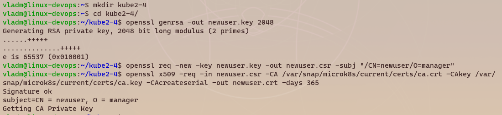
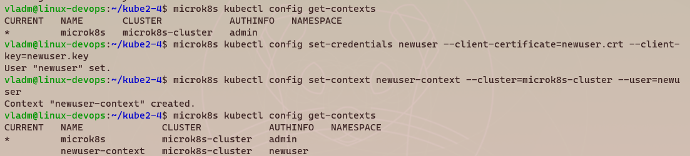
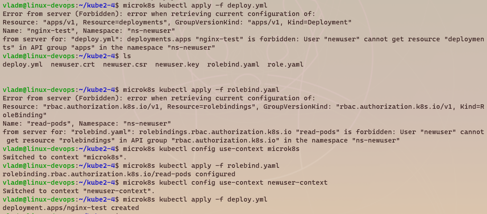
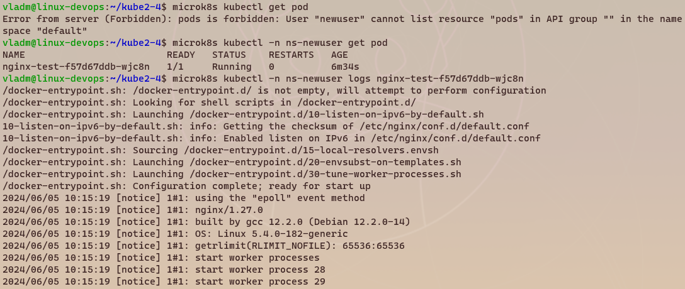
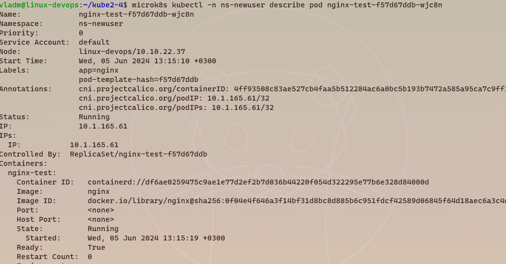

# Задание 1. Создайте конфигурацию для подключения пользователя

1.Создайте и подпишите SSL-сертификат для подключения к кластеру.
>

2.Настройте конфигурационный файл kubectl для подключения.
>

3.Создайте роли и все необходимые настройки для пользователя.
>
>
> 
4.Предусмотрите права пользователя. Пользователь может просматривать логи подов и их конфигурацию (kubectl logs pod <pod_id>, kubectl describe pod <pod_id>).
>Специально не преминял сразу rolebind, пытаюсь сначала задеплоить и получаю ошибку, после переключаюсь обратно в админский контекст, применяю бинд и уже могу деплоить.
> 
> Так же видно, что в default нет прав посмотреть список подов, в ns-newuser доступ есть
> 
> 
> 

5.Предоставьте манифесты и скриншоты и/или вывод необходимых команд.
>Предоставил.